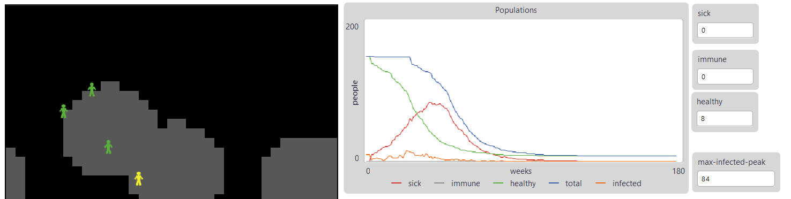
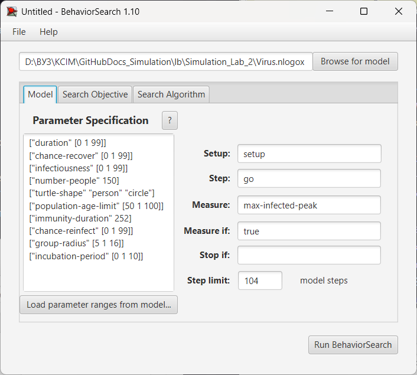
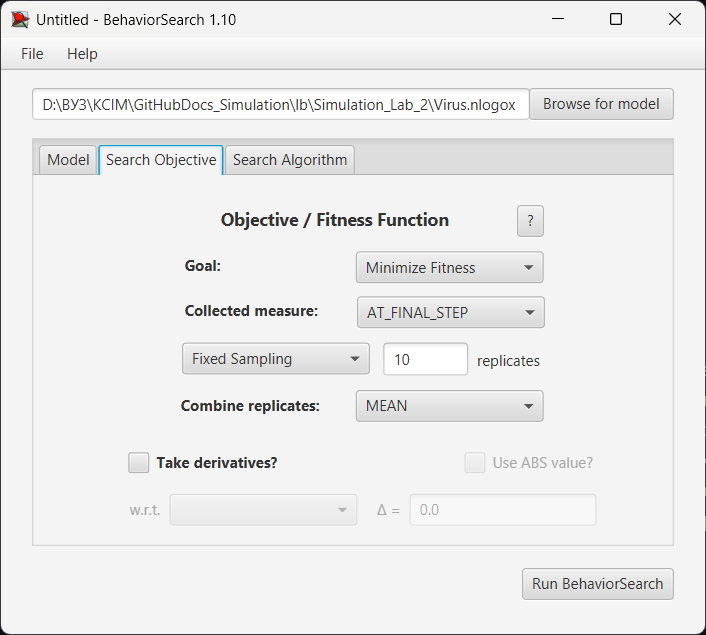
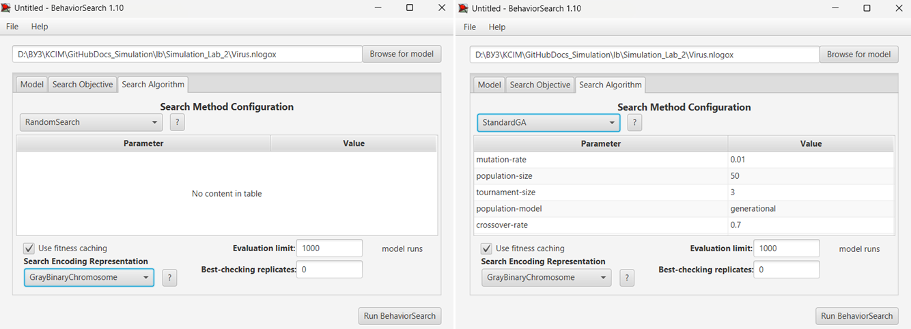
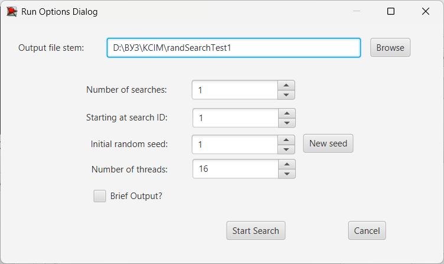
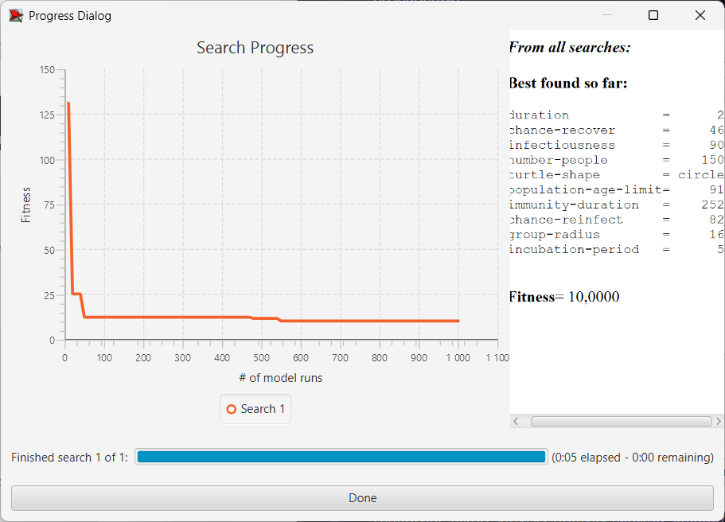
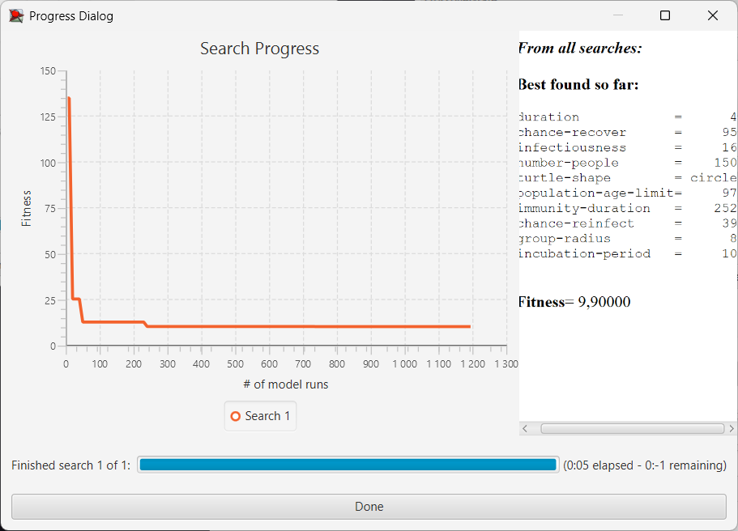
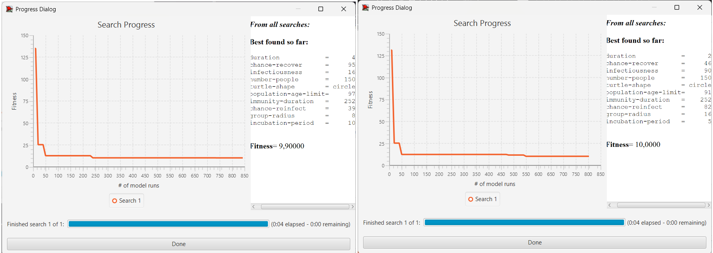
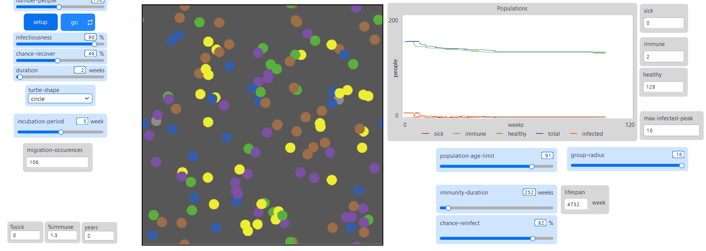
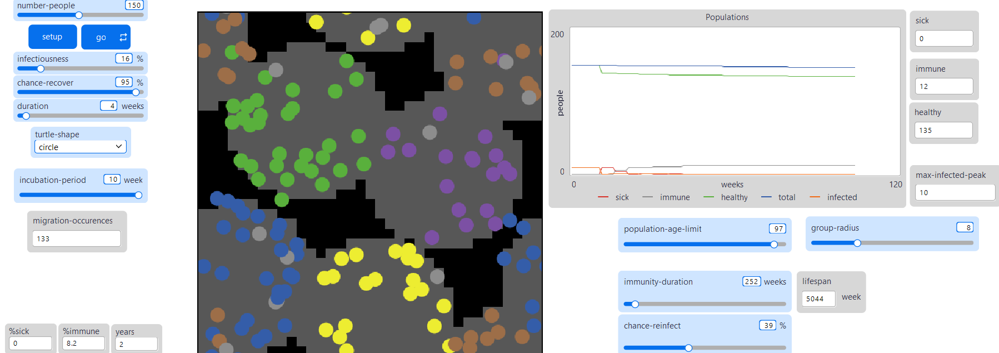

## Комп'ютерні системи імітаційного моделювання
## СПм-24-4, **Бухарова Любов Дмитрівна**
### Лабораторна робота №**3**. Використання засобів обчислювального інтелекту для оптимізації імітаційних моделей

<br>

### Варіант 3, модель у середовищі NetLogo:
[Virus](https://www.netlogoweb.org/launch#https://www.netlogoweb.org/assets/modelslib/Sample%20Models/Biology/Virus.nlogo). Модель поширення захворювання у людській популяції.
<br>

#### Вербальний опис моделі:
Модель імітує передачу та поширення вірусу в людській популяції, де людина моделюється агентом, що показує можливу динаміку розповсюдження епідемії в часі.
Людей розподіллено на п'ять груп, що розподілені випадковим чином у досліджуваному середовищі. Особи мають можливість переходити (перекваліфіковуватися) з групи у будь-яку іншу.
Існує умова перебування лімітованої кількості агентів в загальному замкнутому середовищі.
Фактори заразності, тривалості захворювання, тривалості інкубаційного періоду, шансу одужання, вікової межі існування особи, тривалості імунітету та вірогідності повторного зараження можуть впливати на виживання вірусу, що передається в популяції. 

#### Керуючі параметри:
- **number-people** визначає початкову кількість агентів у середовищі моделювання, тобто, в даній моделі, кількість людей у замкнутому "світі" (середовищі).
- **infectiousness** визначає вірогідність розповсюдження вірусу (наскільки легко вірус передається), коли інфікована та сприйнятлива людина проживають на одній ділянці.
- **chance-recover** визначає вірогідність одужання хворого індивіда, таким чином визначає вірогідність появи імунна.
- **duration** визначає скільки часу людина перебуває в стані хвора (інфікована), перш ніж одужає або помре.
- **turtle-shape** визначає зовнішній вигляд досліджуваних об\`єктів в GUI. (Візуалізація кола в цій моделі має полегшити спостереження за взаємодією агентів, оскільки перекриття між колами легше побачити, ніж між фігурами "людей".)
- **incubation-period**  час інкубаційного періоду
- **population-age-limit** максимально можлива тривалість життя окремої особи
- **immunity-duration** тривалість імунітету у індивіду, який одужав
- **chance-reinfect** вірогідність повторного зараження
- **group-radius** радіус кожної з 5ти випадково розміщених груп

#### Показники роботи модеі:
- максимальна швидкість на поточному такті, тобто, швидкість найшвидшої на даний момент машини.
- найменша швидкість на поточному такті, тобто, швидкість найповільнішої в даний момент машини.
- середня швидкість руху машин на шосе.
- поточна швидкість окремої машини, що відстежується (червона машина).

<br>

### Налаштування середовища BehaviorSearch:

**Обрана модель**:
<pre>
D:\ВУЗ\КСІМ\GitHubDocs_Simulation\lb\Simulation_Lab_2\Virus.nlogox
</pre>
**Параметри моделі** (вкладка Model):  
<pre>
["duration" [0 1 99]]
["chance-recover" [0 1 99]]
["infectiousness" [0 1 99]]
["number-people" 150]
["turtle-shape" "person" "circle" ]
["population-age-limit" [50 1 100]]
["immunity-duration" 1042]
["chance-reinfect" [0 1 99]]
["group-radius" [5 1 16]]
["incubation-period" [0 1 10]]
</pre>
Використовувана **міра**:  

Для фітнес-функції було обрано **максимальне значення одночасно заражених осіб**, вираз для її розрахунку додано до вихідного коду моделі



До процедури go додано змінну current-infected-count, яка використовується для визначення глобальної змінної max-infected-peak:
```
if current-infected-count > max-infected-peak [ set max-infected-peak current-infected-count ]
```
Слід зазначити, що така модифікація не є обов'язковою за умови відповідно налаштованих параметрів пошуку.
  
та вказано у параметрі "**Measure**":
<pre>
max-infected-peak
</pre>
Максимальне значення заражених осіб у одній симуляції обраховується впродовж всіх тактів - відповідно значення повинне враховуватися **наприкінці симуляції** тривалістю 104 тактів (два роки з припущенням того, що 1 такт дорівнює одному тижню).
Параметр зупинки за умовою ("**Stop if**") - не використовувався.  
Загальний вигляд вкладки налаштувань параметрів моделі:  



**Налаштування цільової функції** (вкладка Search Objective):  
Метою підбору параметрів імітаційної моделі, що описує  поширення вірусу в людській популяції (яка поділена на декілька груп), є **мінімізація** значення максимальної кількості хворих осіб – це вказано через параметр "**Goal**" зі значенням **Minimize Fitness**. Тобто необхідно визначити такі параметри налаштувань моделі, при яких кількість хворих індивидів в популяції зменшується. 
Як зазначено вище цільове значення повинне "збиратися" **наприкінці симуляції**. Для цього у параметрі "**Collected measure**", що визначає спосіб обліку значень обраного показника, вказано **AT_FINAL_STEP**.  
Щоб уникнути викривлення результатів через випадкові значення, що використовуються в логіці самої імітаційної моделі (а саме основним фактором зараження є переміщення осіб - яке визначається за випадкових обставин), **кожна симуляція повторюється по 10 разів**, результуюче значення розраховується як **середнє арифметичне**.   
Загальний вигляд вкладки налаштувань цільової функції:  




**Налаштування алгоритму пошуку** (вкладка Search Algorithm):  
Загальний вид вкладки налаштувань алгоритму пошуку:  



<br>

### Результати використання BehaviorSearch:
Діалогове вікно запуску пошуку:  


Результат пошуку параметрів імітаційної моделі, використовуючи **випадковий пошук**:  


Результат пошуку параметрів імітаційної моделі, використовуючи **генетичний алгоритм**:  


Як можна бачити, результати отримані генетичним алгоритмом є кращими за алгоритм випадкового пошуку, проте, за невеликої різниці між значеннями цільової функції: на 0,1 одиницю, з урахуванням округлення до раціональної кількості осіб значення дорівнює 10.

Також слід зазначити, що пошук досягає найкращого значення вже на 550 проході (алгоритм випадкового пошуку)  та на 740 (генетичний алгоритм) - відповідно проведення 1000 прогонів можна скоротити до 800:


#### Перевірка коректності роботи при знайдених параметрах

##### Параметри отримані алгоритмом випадкового пошуку

Результат проведення симуляції зі знайденими параметрами:

В результаті, при заданих параметрах:
```
duration = 2
chance-recover = 46
infectiousness = 90
number-people = 150
turtle-shape = circle
population-age-limit = 91
immunity-duration = 252
chance-reinfect = 82
group-radius = 16
incubation-period = 5
```

вірус зникає менше ніж за два роки та пікове значення не перевищує 10 осіб.
##### Параметри отримані генетичним алгоритмом

Результат проведення симуляції зі знайденими параметрами:

В результаті, при заданих параметрах:
```
duration = 4
chance-recover = 95
infectiousness = 16
number-people = 150
turtle-shape = circle
population-age-limit = 97
immunity-duration = 252
chance-reinfect = 39
group-radius = 8
incubation-period = 10
```
вірус, аналогічним чином, зникає менше ніж за два роки, але пікове значення не перевищує 10 осіб.

Отже, ГА надає кращі результати, але з урахуванням обчислення цілих значень покращення не суттєві. В той самий час алгоритм працює швидше за випадковий пошук - знаходячи значення цілової функції (10) на 240 проході, що на 310 ітерацій раніше за ВП.

Таблиця історії найкращих результатів ГА перебігом у 5000 ітерацій:
<table>
  <thead>
    <tr>
      <th>evaluation</th>
      <th>best-fitness-so-far</th>
    </tr>
  </thead>
  <tbody>
    <tr>
      <td>10</td>
      <td>134.5</td>
    </tr>
    <tr>
      <td>20</td>
      <td>25</td>
    </tr>
    <tr>
      <td>50</td>
      <td>12.4</td>
    </tr>
    <tr>
      <td>240</td>
      <td>10</td>
    </tr>
    <tr>
      <td>740</td>
      <td>9.9</td>
    </tr>
    <tr>
      <td>1270</td>
      <td>9.8</td>
    </tr>
    <tr>
      <td>1930</td>
      <td>9.7</td>
    </tr>
  </tbody>
</table>
