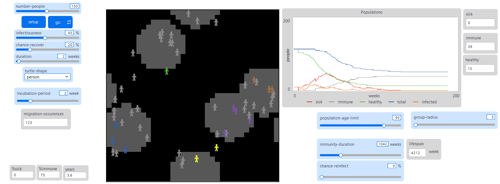
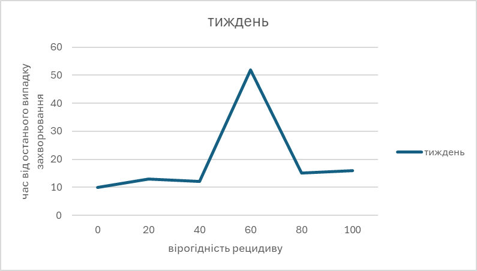
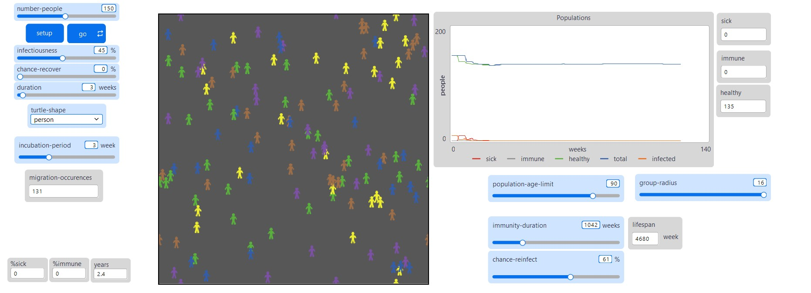

## Комп'ютерні системи імітаційного моделювання
## СПм-24-4, **Бухарова Любов Дмитрівна**
### Лабораторна робота №**2**. Редагування імітаційних моделей у середовищі NetLogo

<br>

### Варіант 3, модель у середовищі NetLogo:
[Virus](https://www.netlogoweb.org/launch#https://www.netlogoweb.org/assets/modelslib/Sample%20Models/Biology/Virus.nlogo). Модель поширення захворювання у людській популяції.

<br>

### Внесені зміни у вихідну логіку моделі, за варіантом:

**Додавання впливу віку на інфікування та результат захворювання.**

У процедурі infect додається змінні впливу на заразність age-factor ( з припущенням, що старші люди є схильними до недуги, що досліджується):

```NetLogo 
to infect ;; turtle procedure  
  ask other turtles-here with [ not sick? and not immune? ]  
    [   
    let age-factor 1  
    if age > 30 and age < 45 [ set age-factor 1.5 ];; middle-aged higher risk  
    if age < 20 [ set age-factor 0.7 ]            ;; young lower risk  
    if age > 60 [ set age-factor 1.3 ]            ;; older also higher risk  
  
    if random-float 100 < (infectiousness * age-factor)  
      [ get-sick ] ] 
end
```

Також з урахуванням того, що вірогідність одужання залишається встановленим для всієї популяції, а не для конкретного індивіда, то зміни було внесено саме до процедури  *recover-or-die*:

``` NetLogo
to recover-or-die ;; turtle procedure  
  if sick-time > duration [  
    let adjusted-recover chance-recover - ((age / lifespan) * age-factor)  
  
    ;; clamp value so it doesn’t go below 0 or above 100  
    if adjusted-recover < 0 [ set adjusted-recover 0 ]  
    if adjusted-recover > 100 [ set adjusted-recover 100 ]  
  
    ;; decide outcome based on adjusted recovery probability  
    ifelse random-float 100 < adjusted-recover  
      [ become-immune ]  
      [ die ]  
  ]  
end
```

У відповідності до формули:
$
\text{EffectiveRecoveryChance} = \text{chance\_recover} - \left( \frac{\text{age}}{\text{lifespan}} \times \text{age\_factor} \right)
$
Слід додати, що у цьому завданні враховано зміну тривалості життя популяції, що описано нижче та додано ініціалізацію змінної age-factor як динамічної, що обраховується для кожного агенту:

```netlogo
to update-dynamics  
  ask turtles [  
    set age-factor 1  
    if age > 30 and age < 45 [ set age-factor 1.5 ]  
    if age < 20 [ set age-factor 0.7 ]  
    if age > 60 [ set age-factor 1.3 ]  
  ]  
end
```

**Додати вплив ступеня поширення захворювання** (поточного відсотка інфікованих) на вірогідність появи нових агентів. 

У відповідності до умови:
 ```
 ifelse sick? [ infect ] [ reproduce ]
 ```
 
 Нові агенти можуть породжуватися тільки за здорових батьків, при цьому, з урахуванням поточної епідемії, доцільною є відсутність потомства:

```netlogo
;; If there are less turtles than the carrying-capacity plus NOT every 3d person is infected  
;; then turtles can reproduce.  
to reproduce  
  if count turtles < carrying-capacity and random-float 100 < chance-reproduce and %infected < 33.3  
    [ hatch 1  
      [ set age 1  
        lt 45 fd 1  
        get-healthy ] ]  
end
```
Відповідно якщо наразі хвора кожна третя особа, то потомство відсутнє.

**Додати можливість регулювання тривалості імунітету та вірогідності захворіти повторно**

На поточний момент у моделі вже передбачена можливість повторного захворіння особистості, так як змінну тривалості імунітету встановлено у 52 тижня (1 рік):

```
set immunity-duration 52
```
По закінченню терміну здорова особа може знову захворіти з такою ж самою вірогідністю як й початкова, а агенти з імунітетом - не можуть.

Однак, у реальному світі різні захворювання можуть по-різному впливати на організм людини та відповідно тривалість імунітету не є постійною, так додано відповідну змінну величину, що залежить від тривалості життя популяції:

![[Pasted image 20251021160931.png]]

З урахуванням означення рецидиву (*Рецидив при інфекційних хворобах пояснюють тією обставиною, що [збудник](https://uk.wikipedia.org/wiki/%D0%9F%D0%B0%D1%82%D0%BE%D0%B3%D0%B5%D0%BD "Патоген") у ході лікування не повністю зникає з організму і, за певних умов, знову спричинює повернення хвороби у вигляді швидкого відновлення клінічних ознак, [симптомів](https://uk.wikipedia.org/wiki/%D0%A1%D0%B8%D0%BC%D0%BF%D1%82%D0%BE%D0%BC "Симптом") захворювання*.) було змінено процедуру recover-or-die на recover-or-die-or-recidere:

<pre>
to recover-or-die-or-recidere ;; turtle procedure  
  if sick-time > duration [  
    let adjusted-recover chance-recover - ((age / lifespan) * age-factor)  
    ;; clamp value so it doesn’t go below 0 or above 100  
    if adjusted-recover /< 0 [ set adjusted-recover 0 ]  
    if adjusted-recover /> 100 [ set adjusted-recover 100 ]  
;    ;; decide outcome based on adjusted recovery probability and reinfection chance     
    ifelse random-float 100 < adjusted-recover [  
      ;; Recovered BUT may relapse  
      ifelse random-float 100 < chance-reinfect  
        [ recidere ]   ;; relapse → sick again  
        [ become-immune ]   
    ] [ die ]    ]  
end
</pre>

Так при відсутності імунітету людина хворіє "другий термін" підряд (процесс лікування обумовлено часовими витратами). Зауважимо, що умова ідеалізації імунітету залишена.
<br>
### Внесені зміни у вихідну логіку моделі, на власний розсуд:

**Зміна логіки переміщення агентів** 

Зараження людини частіше відбувається при прямому контакті з іншими. Дана модель імітує поведінку індивидів, що перебувають в одному замкненому середовищі, у якому агенти можуть легко коммунікувати та інфікувати один одного. 
Проте, так як у сучасному світі люди поділені на умовні шари населення (взаємозв'язки яких можуть й не перетинатися) - доцільним є створення груп населення та з деякою ймовірністю можуть мігрувати між групами.

Так, створено умовні 5 груп:
  
```
globals  
  [ %infected            ;; what % of the population is infectious  
    %immune              ;; what % of the population is immune  
    lifespan             ;; the lifespan of a turtle  
    chance-reproduce     ;; the probability of a turtle generating an offspring each tick  
    carrying-capacity    ;; the number of turtles that can be in the world at one time  
    ;; immunity-duration    ;; how many weeks immunity lasts  
    age-factor           ;; to define what age group more influenced by the virus
    num-groups ]         ;; how many groups of people exist  
```

Зокрема для кожного агента задається відповідний номер та положення на "полі" згідно з  розташуванням центру групи.

У моделі було випадкове встановлення:
```
setxy random-xcor random-ycor
```
Та у відповідності до внесених змін за відповідною формулою:
$$
\begin{align*}
\text{X} &= \text{center\_x} + \left( \text{random-float}(2R) - R \right) \\
\text{Y} &= \text{center\_y} + \left( \text{random-float}(2R) - R \right)
\end{align*}
$$
Виконується встановлення координат:
```
      set group-id random num-groups  
      let center item group-id group-centers  
      let cx item 0 center  
      let cy item 1 center  
      setxy (cx + random-float (group-radius * 2) - group-radius)  
            (cy + random-float (group-radius * 2) - group-radius)
```
Переміщення описано процедурою move:
```
to move ;; turtle procedure  
  let center item group-id group-centers  
  let cx item 0 center  
  let cy item 1 center  
  let distance-to-center distancexy cx cy  
  
  ;; If far away, head back toward center  
  if distance-to-center > group-radius [  
    facexy cx cy  
  ]   
  ;; Otherwise, random wandering  
  rt random 30 - random 15 ;; to expect smother turns  
  fd 0.7 + random-float 0.3  
end
```

Ймовірність міграції має сталий 1 %, імплементована процедура також включає лічильник агентів, які мігрували:

```
to migrate ;; turtle procedure  
  if random-float 1 < migration-chance [  
    let old-group-id group-id  
      
    set group-id random num-groups  
    if old-group-id != group-id [ set migration-occurences migration-occurences + 1 ]  
  ]  
end
```

* для подальшого розвитку взаємодії більш конкретних сфер життєдіяльності доцільним є використання механізму "breeds".

Зображення моделі у процессі симуляції:



**Додавання вікової залежності на процес відтворення нащадків**

Наразі кожна здорова особа має 1% вірогідності залишити нащадка раз на тиждень, незалежно від умов, відповідно доцільним є модифікація механізму відтворення нових індивідів: в залежності, не виключно від стану здоров'я, а й від віку:

```
to reproduce ;; turtle procedure  
  if count turtles < carrying-capacity and %infected < 33.3 [  
    if random-float 100 < chance-reproduce and not sick? and age > 18 and age < 50   
    [ hatch 1  
      [ set age 1  
        lt 45 fd 1  
        get-healthy ] ]  
    ]  
  ]  
end
```

**Додавання інкубаційного періоду**

З змінних агента було додано час інкубаційного періоду та за аналогією з перебігом імунітету поточний час існування індивіда як інфікованого:

```
set incubation-time 0
set incubation-period 5 + random 5 
```

Для подальшої перевірки впливу  тривалості інкубаційного періоду на перебіг розповсюдження вірусу було додано відповідну змінну інтерфейсу.

Відповідно додано процедуру зараження:

```
to get-infected ;; turtle procedure  
  set infected? true  
  set sick? false  
  set incubation-time 0  
  set remaining-immunity 0  
end
```

Додані зміни впроваджену у процедуру запуску "Go":

```
if infected? [ progress-infection ]
```

Відповідно коли особа пройде інкубаційний період - вона стає хворою:

```
to progress-infection ;; turtle procedure  
    set incubation-time incubation-time + 1  
    if incubation-time > incubation-period [  
      set sick? true  
      set infected? false  
      set sick-time 0  
    ]  
end
```

Зазначимо, що у відповідності до внесених змін було також впроваджено графічне відображення зміни станів агентів:

```
to update-display  
  ask turtles [  
    if shape != turtle-shape [ set shape turtle-shape ]  
    if sick? [ set color red ]  
    if infected? [ set color orange ]  
    if immune? [ set color grey ]  
    if not sick? and not immune? [ ;; healthy - colorful  
      set color item group-id [blue green yellow violet brown]   
    ]  
  ]  
end
```

- - -

Фінальний код моделі та її інтерфейс доступні за [посиланням](Virus.nlogox).


## Обчислювальні експерименти

### 1. Вплив вірогідності рецидиву на мінімальну кількість хворих
Досліджується залежність мінімальної кількості хворих осіб  (впродовж 2х років (104 тижня)) від параметру вірогідності рецидиву захворювання.

Початкові значення змінних взяті у відповідності до дослідження вірусу Ебола ([[Lr1_Bukharova#2. Вплив значення вірогідності захворювання особи з імунітетом до вірусу Ебола|див. лр 1]]): 
- duration: 2 тижні (з урахуванням інкубаційного періоду)
- incubation period: 2 тижні 
- chance-recover: 20%
- кількість людей: 150 (за замовченням)
- infectiousness: 45%
- population age limit: 90 (у відповідності до приблизно максимальної очікуваної тривалості життя у світі станом на 2017 рік)
- immunity-duration: 20 років (1042 тижня)

Значення вірогідності повторного захворіння змінюється з кроком 20 (від 0% до 100%, всього 6 симуляцій).
#### 1.1 Дослідження в групах

- згідно з внесеними змінами дослідження проводиться за існування 5ти умовних груп населення.

<table>
  <thead>
    <tr>
      <th>Вірогідність рецидиву</th>
      <th>Тиждень</th>
    </tr>
  </thead>
  <tbody>
    <tr>
      <td>0</td>
      <td>10</td>
    </tr>
    <tr>
      <td>20</td>
      <td>13</td>
    </tr>
    <tr>
      <td>40</td>
      <td>12</td>
    </tr>
    <tr>
      <td>60</td>
      <td>52</td>
    </tr>
    <tr>
      <td>80</td>
      <td>15</td>
    </tr>
    <tr>
      <td>100</td>
      <td>16</td>
    </tr>
  </tbody>
</table>



Базуючись на отриманих даних, можна помітити наявність різкого нелінійного стрибка у значенні "Тиждень" при ймовірності рецидиву 60%.  Отже, дані вказують на те, що ймовірність рецидиву у 60 % в  є критичним порогом, за якого тривалість життя досліджуваного вірусу є найдовшою. 

Також можна допустити, що в даній моделі суттєвим фактором є значення тривалості захворювання, так навіть за умови смертельного вірусу, при короткій тривалості хвороби, вірус майже не впливає на життя популяції:


